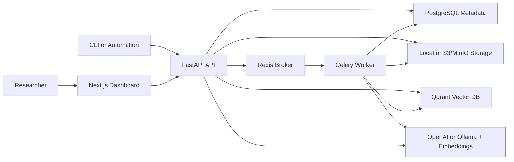

# Architecture

The Semantic Research Assistant is a full-stack retrieval-augmented generation system for private document research. It ingests PDFs, text files, Markdown, and URLs; extracts and chunks text; embeds chunks into Qdrant; stores metadata in PostgreSQL; and exposes cited search, Q&A, summaries, comparisons, and literature synthesis through a Next.js dashboard and API-key workflows.

## System Diagram

## Backend Layers

- `api/routes`: FastAPI HTTP surface for auth, documents, search, Q&A, research extraction, projects, exports, metrics, and operations.
- `services`: business logic for RAG, retrieval, document lifecycle, storage, AI calls, usage tracking, exports, and web ingestion.
- `models`: SQLAlchemy entities for users, documents, projects, notes, history, usage, evaluations, and research extractions.
- `workers`: Celery jobs for document parsing, chunking, embedding, indexing, summarization, and extraction.
- `core`: configuration, JWT/API-key/password helpers, logging, rate limiting, and security headers.

## Ingestion Flow

1. User uploads a document or submits a URL.
2. FastAPI validates the input, stores the source, and creates metadata in PostgreSQL.
3. A Celery task extracts text with LangChain loaders where appropriate.
4. Text is split with LangChain text splitters.
5. Embeddings are generated with OpenAI or sentence-transformers.
6. Chunks and payload metadata are upserted into Qdrant.
7. Summaries and structured research fields are stored with the document record.

## Retrieval Flow

1. User asks a question, runs semantic search, or starts a comparison.
2. Optional query rewriting expands vague research questions.
3. Retrieval combines vector search, keyword search, score fusion, and lightweight reranking.
4. Results are filtered by user, document, project, source type, tags, and relevance threshold.
5. LangChain/LCEL-style chains generate answers from retrieved context.
6. The API returns source citations with document, page, chunk, score, and excerpt metadata.

## Data Stores

- PostgreSQL stores durable metadata, auth records, summaries, notes, history, usage, evaluations, and extraction records.
- Qdrant stores embedding vectors and chunk payloads.
- Redis powers Celery background jobs and can back distributed rate limiting.
- Local disk or S3/MinIO stores uploaded source files.
- The preview endpoint streams owned source files back to the dashboard for browser PDF/text preview and citation review.

## Production Concerns

- Caddy terminates HTTPS in the production Compose override.
- `/health` provides liveness and `/health/ready` checks Postgres, Redis, and Qdrant.
- `/api/metrics` exposes Prometheus-style application metrics.
- OpenTelemetry can trace FastAPI requests, SQLAlchemy queries, Redis/Celery work, Qdrant operations, embeddings, and LLM calls.
- Backup and restore scripts cover PostgreSQL, uploads, Qdrant data, and MinIO data.
- Security controls include refresh-token revocation, hashed scoped API keys, per-key daily usage limits, rate limiting, security headers, upload validation, and per-user retrieval filters.
